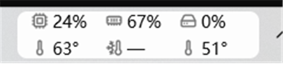
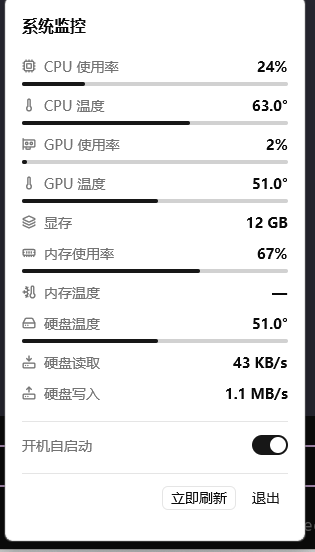
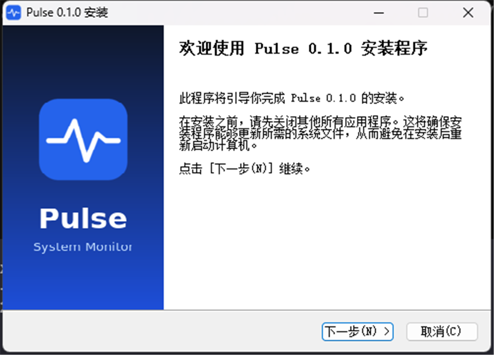

# Pulse · 任务栏系统监控


一个常驻 **Windows 任务栏**的轻量系统监控：平时是任务栏右侧的一个小部件，点一下弹出详情面板。
传感器数据来自 [LibreHardwareMonitor](https://github.com/LibreHardwareMonitor/LibreHardwareMonitor)（通过自带的 `LhmNative.dll`）。

<p align="center">
  
</p>
<p align="center">
  
</p>

## 功能

**任务栏部件**（2 行 × 3 列）

- 第 1 行：CPU / 内存 / 硬盘 **使用率**
- 第 2 行：CPU / 内存 / 硬盘 **温度**
- 启动后传感器初始化期间显示 `正在初始化…`，此期间不响应点击

**详情面板**（点击部件展开）

- CPU：使用率、温度
- GPU：使用率、温度、显存
- 内存：使用率、温度
- 硬盘：活动率、温度、读取、写入
- 底部：**开机自启动** 开关（读写 `HKCU\...\Run`）、立即刷新、退出

**交互**

- 点击部件开合面板；**点击别处自动关闭**（失去焦点）
- 拖拽面板标题可移动面板

## 数据来源与依赖

| 指标 | 来源 |
| --- | --- |
| CPU/GPU/内存/硬盘 使用率、显存、温度 | LibreHardwareMonitor（`lib/LhmNative.dll`） |
| CPU 封装温度、内存(SPD) 温度 | 需要 **PawnIO** 内核驱动（读 MSR / SMBus） |

> [!IMPORTANT]
> **CPU 温度、内存温度依赖 PawnIO 驱动。** 没有它时这两个值显示 `—`，其它指标正常。
> 安装包会自带 `PawnIO_setup.exe`，仅在系统未安装时**提权安装一次**。
> 内存温度还取决于内存条是否带温度传感器（多数消费级 DDR4/DDR5 没有）。

## 安装 / 下载

[Releases](../../releases) 提供三种。发布产物按 `Pulse-<版本>-<平台>-<类型>` 命名（当前平台为 `windows-x64`）：

| 方式 | 文件 | 说明 |
| --- | --- | --- |
| **安装包**（推荐） | `Pulse-0.1.0-windows-x64-Setup.exe` | 装到 `%LOCALAPPDATA%\Programs\Pulse`，建开始菜单/桌面快捷方式、默认开机自启、自带卸载程序。用户级，**默认不需要管理员**，仅首次装 PawnIO 驱动时弹一次 UAC |
| **便携版** | `Pulse-0.1.0-windows-x64-portable.zip` | 解压即用，含 `Pulse.exe` + `lib\` + `assets\` |
| **单独 exe** | `Pulse-0.1.0-windows-x64.exe` | 只下主程序。**需自行把 `lib\LhmNative.dll` 放到它旁边**，否则启动后没有数据 |

<p align="center">
  
</p>

> 其它平台（如 `linux-x64` / `linux-arm64` / `macos-arm64`）待适配；命名沿用同一约定。

安装 / 解压后的目录结构：

```
Pulse\
├── Pulse.exe              主程序（已内嵌应用图标）
├── lib\
│   ├── LhmNative.dll      LibreHardwareMonitor 封装（NativeAOT）
│   └── PawnIO_setup.exe   传感器驱动安装器（按需运行）
├── assets\
│   └── pulse.ico
└── Uninstall.exe
```

## 从源码构建

需要 **Rust stable（≥ 1.88：edition 2024 + let-chains）** 与 Windows MSVC 工具链。

```bat
cargo build --release          :: 产物 target\release\Pulse.exe
installer\build.bat            :: 用 NSIS 打包，产物 installer\Pulse-<版本>-windows-x64-Setup.exe
```

`installer\build.bat` 会依次找 `C:\Program Files (x86)\NSIS\makensis.exe` 和 PATH 里的 `makensis`。

调试 / 测试：

```bat
cargo run                      :: 直接运行（无需打包）
cargo test                     :: 单元测试
cargo test test_lhm -- --ignored --nocapture   :: 需要 PawnIO 与真实硬件
```

## 项目结构

```
src/
├── main.rs / lib.rs / app.rs   入口与启动装配
├── internal/                   业务与平台（与 UI 无关）
│   ├── autostart/              开机自启（注册表）
│   ├── lhm/                    LHM DLL 封装 + JSON 模型
│   ├── pulse_monit/            采集线程：LHM → Metrics
│   └── taskbar/                Windows 任务栏嵌入与定位
└── ui/                         展示层
    ├── taskbar_widget.rs       任务栏部件
    ├── expand_panel.rs         详情面板
    ├── metric_item.rs          指标行组件
    └── drag.rs                 面板拖拽
lib/                            第三方二进制（LhmNative.dll、PawnIO_setup.exe）
installer/                      NSIS 脚本、图标、安装向导素材
docs/                           README 截图
```

## 技术栈

- Rust 2024
- [gpui-kit](https://gpui-kit.com)（GPUI）桌面 UI
- LibreHardwareMonitor（编译为 NativeAOT DLL）+ [PawnIO](https://pawnio.eu)
- NSIS 打包

## 第三方组件

| 组件 | 许可 | 说明 |
| --- | --- | --- |
| [LibreHardwareMonitor](https://github.com/LibreHardwareMonitor/LibreHardwareMonitor) | MPL-2.0 | `lib/LhmNative.dll` 内含 LibreHardwareMonitorLib |
| [PawnIO](https://pawnio.eu) | 见上游 | `lib/PawnIO_setup.exe`（namazso 签名） |

再分发前请确认各自的许可条款，详见 [THIRD-PARTY.md](THIRD-PARTY.md)。

## License

[MIT](LICENSE)
